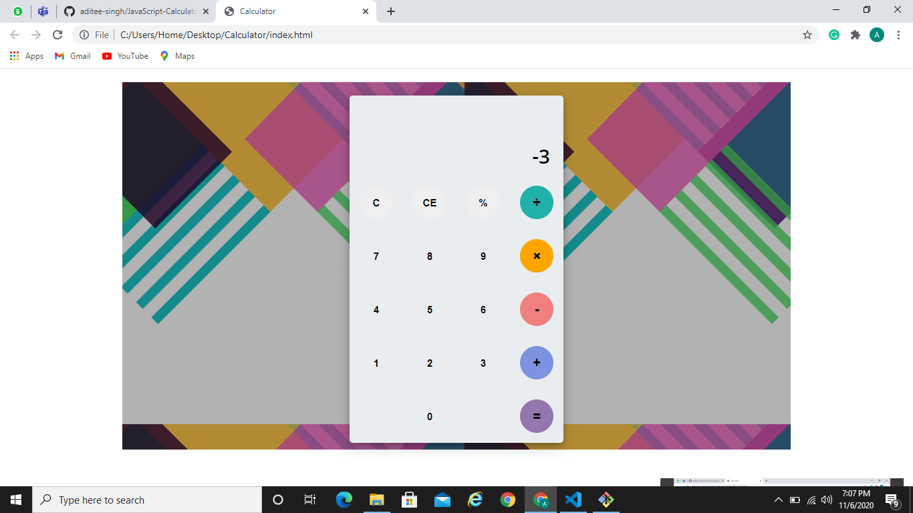

## Calculator

Designed a calculator from scratch using HTML, CSS, JavaSript.

## Webview

## Implementation

- This is a simple calculator built using HTML, CSS and JavaScript.

- It performs all basic mathematical calculations.

- Enhances readability by adding commas while displaying large numbers.

- It works fine for specific cases like a negation preceding a number and two operators pressed simultaneously.

## Instructions

- Just open the index.html file
 
 ## Technologies used

 - HTML
 - CSS
 - JavaScript